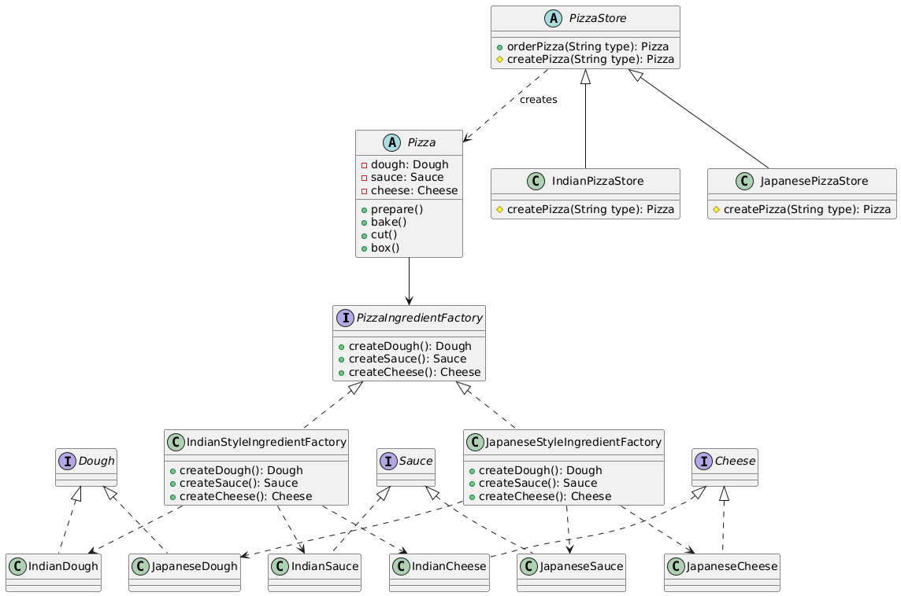

# Abstract Factory

## Table of Contents

- [Introduction](#introduction)
- [Problem](#problem)
- [Real World Examples](#real-world-examples)
- [Structure](#structure)
- [Implementation](#implementation)
- [Advantages](#advantages)
- [Disadvantages](#disadvantages)
- [Relationship with other patterns](#relationship-with-other-patterns)
- [References](#references)

## Introduction

**Abstract Factory** is a creational design pattern that provides an interface for creating families of related or dependent objects without specifying their concrete classes.

## Problem

## Real World Examples

- It is used in core Java classes like **`java.util.DocumentBuilderFactory`** and **`java.util.TransformerFactory`**

## Structure

- **Abstract Factory** : Declares an interface for operations that create abstract product objects.
- **Concrete Factory** : Implements the operations to create concrete product objects.
- **Abstract Product** : Declares an interface for a type of product object.
- **Concrete Product** : Implements the Abstract Product interface.
- **Client** : Uses Abstract Factory and Abstract Product interfaces to create a product object.

## Implementation

[Client : PizzaStore](src/store/PizzaStore.java)

[Abstract Factory : PizzaIngredientFactory](src/ingredients/factory/PizzaIngredientFactory.java)

[Concrete Factory : IndianStyleIngredientFactory](src/ingredients/factory/IndianStyleIngredientFactory.java)

[Concrete Factory : JapaneseStyleIngredientFactory](src/ingredients/factory/JapaneseStyleIngredientFactory.java)

[Abstract Product : Cheese](src/ingredients/cheese/Cheese.java)

[Abstract Product : Dough](src/ingredients/dough/Dough.java)

[Abstract Product : Sauce](src/ingredients/sauce/Sauce.java)

[Concrete Product : MozzarellaCheese](src/ingredients/cheese/MozzarellaCheese.java)

[Concrete Product : NaanDough](src/ingredients/dough/NaanDough.java)

[Concrete Product : TikkaMasalaSauce](src/ingredients/sauce/TikkaMasalaSauce.java)

[Concrete Product : ParmesanCheese](src/ingredients/cheese/ParmesanCheese.java)

[Concrete Product : MochiDough](src/ingredients/dough/MochiDough.java)

[Concrete Product : SoySauce](src/ingredients/sauce/SoySauce.java)

## Advantages

- The products from the factory are related to each other.
- Avoids tight coupling between the client and the concrete products.
- Follows the open/closed principle.
- Follows the single responsibility principle.

## Disadvantages

- More complex than the factory method.

## Relationship with other patterns

- Factory Method is simpler than Abstract Factory and often serves as a starting point before evolving to more complex patterns.

- Abstract Factory creates families of related objects, while Builder constructs complex objects step by step.

- Abstract Factory often uses Factory Methods internally.

- Abstract Factory can replace Facade when you just need to hide object creation.

- Abstract Factory works well with Bridge when certain abstractions need specific implementations.

- Abstract Factory can be implemented as a Singleton.

## References

- [Refactoring Guru](https://refactoring.guru/design-patterns/abstract-factory)
- [Head First Design Patterns](https://www.oreilly.com/library/view/head-first-design/0596007124/)
