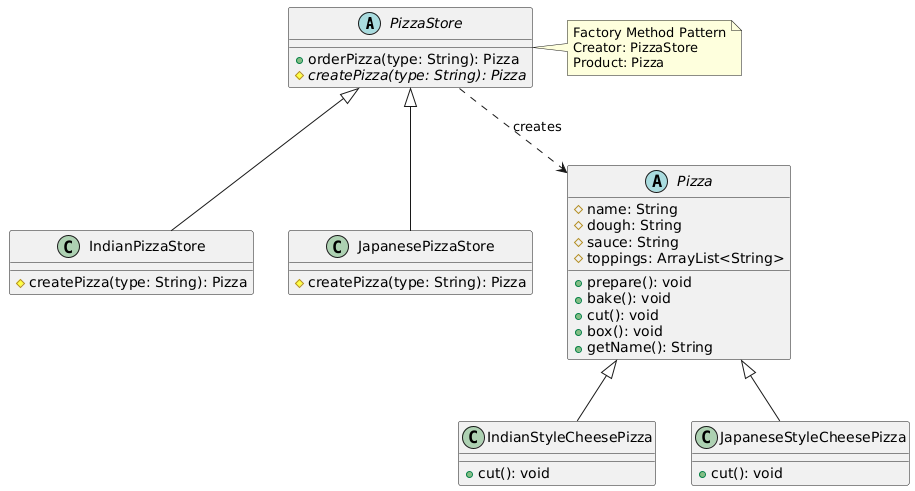

# Factory Method

## Table of Contents

- [Introduction](#introduction)
- [Problem](#problem)
- [Real World Examples](#real-world-examples)
- [Structure](#structure)
- [Implementation](#implementation)
- [Advantages](#advantages)
- [Disadvantages](#disadvantages)
- [Relationship with other patterns](#relationship-with-other-patterns)
- [References](#references)

## Introduction

**Factory Method** is a creational design pattern that provides an interface for creating objects in a superclass, but allows subclasses to alter the type of objects that will be created.

## Problem

Each time when we create an object, we need to specify which class to instantiate. This is not good because it makes the code inflexible to changes.

## Real World Examples

- It is used in core Java classes like **`java.util.Calendar`** and **`java.util.ResourceBundle`**

## Structure

- **Product** : An interface or abstract class that defines the common interface for objects the factory method creates.
- **ConcreteProduct** : A concrete class that implements the Product interface.
- **Creator** : An abstract class that declares the factory method, which returns Product Object.
- **ConcreteCreator** : Subclasses that override the factory method to return specific ConcreteProduct instances

## Implementation

[Client](src/Main.java)

[Product : Pizza](src/Pizza.java)

[ConcreteProduct : IndianStyleCheesePizza](src/IndianStyleCheesePizza.java)

[ConcreteProduct : JapaneseStyleCheesePizza](src/JapaneseStyleCheesePizza.java)

[Creator : PizzaStore](src/PizzaStore.java)

[ConcreteCreator : IndianPizzaStore](src/IndianPizzaStore.java)

[ConcreteCreator : JapanesePizzaStore](src/JapanesePizzaStore.java)

## Advantages

- Avoid tight coupling between the client and the concrete product.

- Single Responsibility Principle is followed.

- Open/Closed Principle is followed.

## Disadvantages

- More complicated code.

## Relationship with other patterns

Factory Method is often the starting point for many designs before moving to more complex patterns like Abstract Factory, Prototype, or Builder.

Factory Method works well with other patterns:

- It can be used with Iterator to create different iterator types
- It's simpler than Prototype as it doesn't need complex initialization
- It can be part of a Template Method pattern

Factory Method is inheritance-based, making it simpler to implement but less flexible than some other creational patterns.

## References

- [Refactoring Guru](https://refactoring.guru/design-patterns/singleton)
- [Head First Design Patterns](https://www.oreilly.com/library/view/head-first-design/0596007124/)
